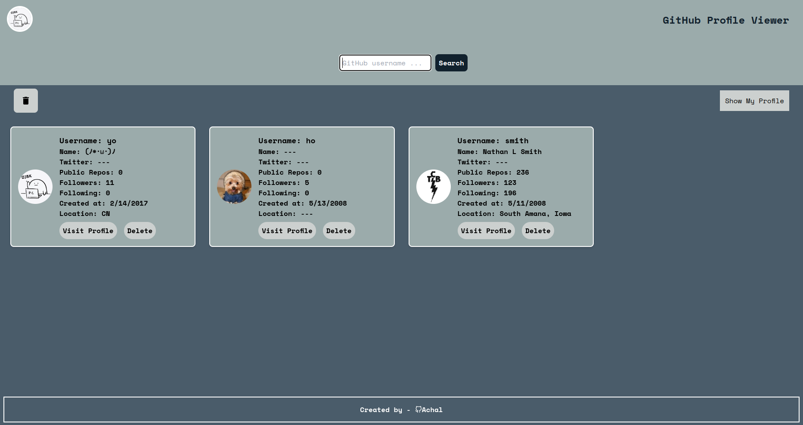

# GitHub Profile Viewer

GitHub Profile Viewer is a web application built with React that allows users to search and view GitHub profiles easily. It provides a simple and intuitive interface for interacting with GitHub user data.

## Features

- **Search Profiles:** Enter a GitHub username to fetch and display profile information.
- **Persistent Card Display:** Saved user profiles persist across page reloads using local storage.
- **Profile Viewing:** Click on "Show My Profile" to view your own GitHub profile.
- **Responsive Design:** The application is designed to be responsive and user-friendly across different devices.

## Screenshots


*Search Page: Enter a GitHub username to fetch profile information.*


*Profile View: Enter your Github username*

## Technologies Used

- React
- Tailwind CSS
- React Router DOM

## Getting Started

To get a local copy up and running follow these simple steps.

### Prerequisites

- Node.js installed on your local environment
- npm or yarn package manager

### Installation

1. Clone the repository:

  ```bash
  git clone <repository-url>
  cd github-profile-viewer
  ```

2. Install dependencies:

  ```bash
  npm install
  ```

3. Add your GitHub Personal Access Token:

    a. Obtain a GitHub Personal Access Token with appropriate permissions (Read access to user profile data).

    b .Add your token in the Card.jsx line no. 5

4. Start the application:

  ```bash
  npm start
  ```

5. Open the application in your browser:

Open http://localhost:5173 to view the app in your browser.

# Contributing
Contributions are welcome! If you find any bugs or have suggestions for improvements, please open an issue or create a pull request.

# License
This project is licensed under the MIT License - see the LICENSE file for details.

